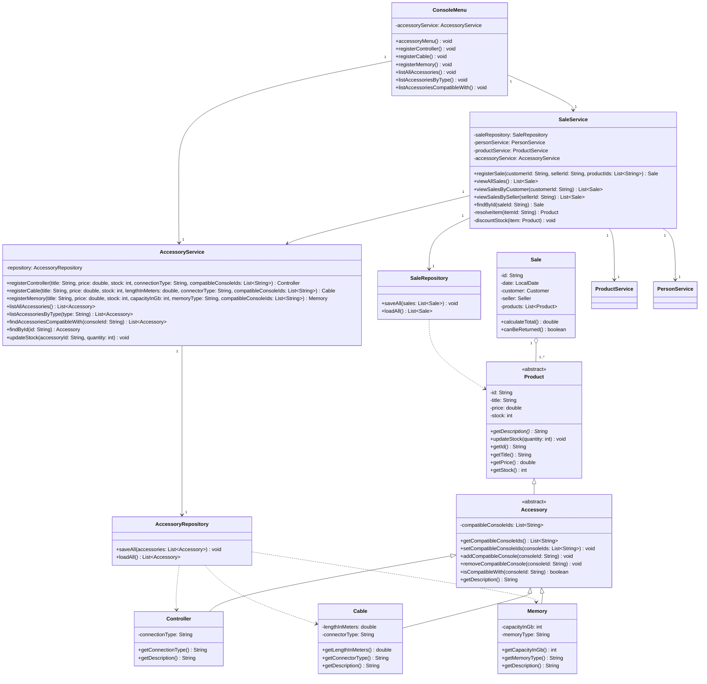

# Accessory Class Diagram — GameZone Unicesar

```mermaid
classDiagram

    %% ===== ACCESSORY MODEL HIERARCHY =====
    class Product {
        <<abstract>>
        -id: String
        -title: String
        -price: double
        -stock: int
        +getDescription() String*
        +updateStock(quantity: int) void
        +getId() String
        +getTitle() String
        +getPrice() double
        +getStock() int
    }
    class Accessory {
        <<abstract>>
        -compatibleConsoleIds: List~String~
        +getCompatibleConsoleIds() List~String~
        +setCompatibleConsoleIds(consoleIds: List~String~) void
        +addCompatibleConsole(consoleId: String) void
        +removeCompatibleConsole(consoleId: String) void
        +isCompatibleWith(consoleId: String) boolean
        +getDescription() String
    }
    class Controller {
        -connectionType: String
        +getConnectionType() String
        +getDescription() String
    }
    class Cable {
        -lengthInMeters: double
        -connectorType: String
        +getLengthInMeters() double
        +getConnectorType() String
        +getDescription() String
    }
    class Memory {
        -capacityInGb: int
        -memoryType: String
        +getCapacityInGb() int
        +getMemoryType() String
        +getDescription() String
    }

    Product <|-- Accessory
    Accessory <|-- Controller
    Accessory <|-- Cable
    Accessory <|-- Memory

    %% ===== SALES INTEGRATION =====
    class Sale {
        -id: String
        -date: LocalDate
        -customer: Customer
        -seller: Seller
        -products: List~Product~
        +calculateTotal() double
        +canBeReturned() boolean
    }
    Sale "1" o-- "1..*" Product

    %% ===== PERSISTENCE LAYER =====
    class AccessoryRepository {
        +saveAll(accessories: List~Accessory~) void
        +loadAll() List~Accessory~
    }
    class SaleRepository {
        +saveAll(sales: List~Sale~) void
        +loadAll() List~Sale~
    }

    AccessoryRepository ..> Controller
    AccessoryRepository ..> Cable
    AccessoryRepository ..> Memory
    SaleRepository ..> Product

    %% ===== SERVICE LAYER =====
    class AccessoryService {
        -repository: AccessoryRepository
        +registerController(title: String, price: double, stock: int, connectionType: String, compatibleConsoleIds: List~String~) Controller
        +registerCable(title: String, price: double, stock: int, lengthInMeters: double, connectorType: String, compatibleConsoleIds: List~String~) Cable
        +registerMemory(title: String, price: double, stock: int, capacityInGb: int, memoryType: String, compatibleConsoleIds: List~String~) Memory
        +listAllAccessories() List~Accessory~
        +listAccessoriesByType(type: String) List~Accessory~
        +findAccessoriesCompatibleWith(consoleId: String) List~Accessory~
        +findById(id: String) Accessory
        +updateStock(accessoryId: String, quantity: int) void
    }
    class SaleService {
        -saleRepository: SaleRepository
        -personService: PersonService
        -productService: ProductService
        -accessoryService: AccessoryService
        +registerSale(customerId: String, sellerId: String, productIds: List~String~) Sale
        +viewAllSales() List~Sale~
        +viewSalesByCustomer(customerId: String) List~Sale~
        +viewSalesBySeller(sellerId: String) List~Sale~
        +findById(saleId: String) Sale
        -resolveItem(itemId: String) Product
        -discountStock(item: Product) void
    }

    AccessoryService "1" --> "1" AccessoryRepository
    SaleService "1" --> "1" SaleRepository
    SaleService "1" --> "1" ProductService
    SaleService "1" --> "1" AccessoryService
    SaleService "1" --> "1" PersonService

    %% ===== UI LAYER =====
    class ConsoleMenu {
        -accessoryService: AccessoryService
        +accessoryMenu() void
        +registerController() void
        +registerCable() void
        +registerMemory() void
        +listAllAccessories() void
        +listAccessoriesByType() void
        +listAccessoriesCompatibleWith() void
    }

    ConsoleMenu "1" --> "1" AccessoryService
    ConsoleMenu "1" --> "1" SaleService
```