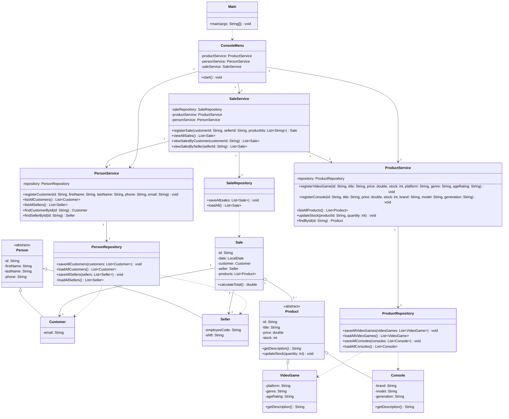

# Full Class Diagram — GameZone Unicesar

```mermaid
classDiagram

    %% ===== MODEL LAYER =====
    class Person {
        <<abstract>>
        -id: String
        -firstName: String
        -lastName: String
        -phone: String
    }
    class Customer {
        -email: String
    }
    class Seller {
        -employeeCode: String
        -shift: String
    }
    class Product {
        <<abstract>>
        -id: String
        -title: String
        -price: double
        -stock: int
        +getDescription() String*
        +updateStock(quantity: int) void
    }
    class VideoGame {
        -platform: String
        -genre: String
        -ageRating: String
        +getDescription() String
    }
    class Console {
        -brand: String
        -model: String
        -generation: String
        +getDescription() String
    }
    class Sale {
        -id: String
        -date: LocalDate
        -customer: Customer
        -seller: Seller
        -products: List~Product~
        +calculateTotal() double
    }

    Person <|-- Customer
    Person <|-- Seller
    Product <|-- VideoGame
    Product <|-- Console
    Sale "1" --> "1" Customer
    Sale "1" --> "1" Seller
    Sale "1" o-- "1..*" Product

    %% ===== PERSISTENCE LAYER =====
    class ProductRepository {
        +saveAllVideoGames(videoGames: List~VideoGame~) void
        +loadAllVideoGames() List~VideoGame~
        +saveAllConsoles(consoles: List~Console~) void
        +loadAllConsoles() List~Console~
    }
    class PersonRepository {
        +saveAllCustomers(customers: List~Customer~) void
        +loadAllCustomers() List~Customer~
        +saveAllSellers(sellers: List~Seller~) void
        +loadAllSellers() List~Seller~
    }
    class SaleRepository {
        +saveAll(sales: List~Sale~) void
        +loadAll() List~Sale~
    }

    ProductRepository ..> VideoGame
    ProductRepository ..> Console
    PersonRepository ..> Customer
    PersonRepository ..> Seller
    SaleRepository ..> Sale

    %% ===== SERVICE LAYER =====
    class ProductService {
        -repository: ProductRepository
        +registerVideoGame(id: String, title: String, price: double, stock: int, platform: String, genre: String, ageRating: String) void
        +registerConsole(id: String, title: String, price: double, stock: int, brand: String, model: String, generation: String) void
        +listAllProducts() List~Product~
        +updateStock(productId: String, quantity: int) void
        +findById(id: String) Product
    }
    class PersonService {
        -repository: PersonRepository
        +registerCustomer(id: String, firstName: String, lastName: String, phone: String, email: String) void
        +listAllCustomers() List~Customer~
        +listAllSellers() List~Seller~
        +findCustomerById(id: String) Customer
        +findSellerById(id: String) Seller
    }
    class SaleService {
        -saleRepository: SaleRepository
        -productService: ProductService
        -personService: PersonService
        +registerSale(customerId: String, sellerId: String, productIds: List~String~) Sale
        +viewAllSales() List~Sale~
        +viewSalesByCustomer(customerId: String) List~Sale~
        +viewSalesBySeller(sellerId: String) List~Sale~
    }

    ProductService "1" --> "1" ProductRepository
    PersonService "1" --> "1" PersonRepository
    SaleService "1" --> "1" SaleRepository
    SaleService "1" --> "1" ProductService
    SaleService "1" --> "1" PersonService

    %% ===== UI LAYER =====
    class ConsoleMenu {
        -productService: ProductService
        -personService: PersonService
        -saleService: SaleService
        +start() void
    }

    ConsoleMenu "1" --> "1" ProductService
    ConsoleMenu "1" --> "1" PersonService
    ConsoleMenu "1" --> "1" SaleService

    %% ===== ENTRY POINT =====
    class Main {
        +main(args: String[]) void
    }

    Main ..> ConsoleMenu
```
