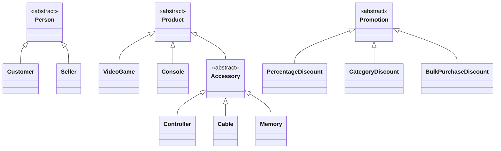

# Model Layer — Class Hierarchies

```mermaid
classDiagram
    class Person {
        <<abstract>>
    }
    class Customer
    class Seller
    Person <|-- Customer
    Person <|-- Seller

    class Product {
        <<abstract>>
    }
    class VideoGame
    class Console
    Product <|-- VideoGame
    Product <|-- Console

    class Accessory {
        <<abstract>>
    }
    class Controller
    class Cable
    class Memory
    Product <|-- Accessory
    Accessory <|-- Controller
    Accessory <|-- Cable
    Accessory <|-- Memory

    class Promotion {
        <<abstract>>
    }
    class PercentageDiscount
    class CategoryDiscount
    class BulkPurchaseDiscount
    Promotion <|-- PercentageDiscount
    Promotion <|-- CategoryDiscount
    Promotion <|-- BulkPurchaseDiscount
```
