# Integrated Class Diagram — GameZone Unicesar

Single class diagram of the integrated system: the four layers (model, persistence, service and user interface) with the base system and the four extensions (accessories, promotions, warranties and returns). It reflects the final code after the integration adjustments A1 to A7 described in [integration-analysis.md](integration-analysis.md).

```mermaid
classDiagram

    %% ===== MODEL LAYER: people =====
    class Person {
        <<abstract>>
        -id: String
        -firstName: String
        -lastName: String
        -phone: String
    }
    class Customer {
        -email: String
    }
    class Seller {
        -employeeCode: String
        -shift: String
    }

    %% ===== MODEL LAYER: products and accessories =====
    class Product {
        <<abstract>>
        -id: String
        -title: String
        -price: double
        -stock: int
        +getDescription() String*
        +getCategory() String*
        +updateStock(quantity: int) void
    }
    class VideoGame {
        -platform: String
        -genre: String
        -ageRating: String
    }
    class Console {
        -brand: String
        -model: String
        -generation: String
    }
    class Accessory {
        <<abstract>>
        -compatibleConsoleIds: List~String~
        +isCompatibleWith(consoleId: String) boolean
        +addCompatibleConsole(consoleId: String) void
        +removeCompatibleConsole(consoleId: String) void
    }
    class Controller {
        -connectionType: String
    }
    class Cable {
        -lengthInMeters: double
        -connectorType: String
    }
    class Memory {
        -capacityInGb: int
        -memoryType: String
    }

    %% ===== MODEL LAYER: sales and returns =====
    class Sale {
        -id: String
        -date: LocalDate
        -customer: Customer
        -seller: Seller
        -products: List~Product~
        -warrantyExtraCost: double
        -appliedPromotionName: String
        -discountAmount: double
        +calculateSubtotal() double
        +calculateTotal() double
        +generateReceipt() String
        +canBeReturned() boolean
    }
    class Return {
        -id: String
        -saleId: String
        -date: LocalDate
        -customer: Customer
        -seller: Seller
        -products: List~Product~
        -saleSubtotal: double
        -saleDiscount: double
        -warrantyRefund: double
        +calculateRefundAmount() double
        +generateReturnReceipt() String
    }

    %% ===== MODEL LAYER: warranties =====
    class Warranty {
        <<abstract>>
        -id: String
        -product: Product
        -sale: Sale
        -startDate: LocalDate
        -endDate: LocalDate
        +getDurationInMonths() int*
        +getWarrantyType() String*
        +getAdditionalCost() double*
        +isActive(date: LocalDate) boolean
        +generateWarrantyCertificate() String
    }
    class BasicWarranty
    class ExtendedWarranty

    %% ===== MODEL LAYER: promotions =====
    class Promotion {
        <<abstract>>
        -id: String
        -name: String
        -startDate: LocalDate
        -endDate: LocalDate
        -discountPercentage: double
        +calculateDiscount(products: List~Product~) double*
        +isActive(date: LocalDate) boolean
    }
    class PercentageDiscount
    class CategoryDiscount {
        -targetCategory: String
    }
    class BulkPurchaseDiscount {
        -minimumQuantity: int
    }

    %% ----- model relationships -----
    Person <|-- Customer
    Person <|-- Seller
    Product <|-- VideoGame
    Product <|-- Console
    Product <|-- Accessory
    Accessory <|-- Controller
    Accessory <|-- Cable
    Accessory <|-- Memory
    Warranty <|-- BasicWarranty
    Warranty <|-- ExtendedWarranty
    Promotion <|-- PercentageDiscount
    Promotion <|-- CategoryDiscount
    Promotion <|-- BulkPurchaseDiscount

    Sale "1" --> "1" Customer
    Sale "1" --> "1" Seller
    Sale "1" o-- "1..*" Product
    Return "1" --> "1" Customer
    Return "1" --> "1" Seller
    Return "1" o-- "1..*" Product
    Return ..> Sale : saleId
    Warranty "*" --> "1" Product
    Warranty "*" --> "1" Sale
    Accessory ..> Console : compatibleConsoleIds
    Promotion ..> Product : calculateDiscount

    %% ===== PERSISTENCE LAYER =====
    class PersonRepository {
        +saveAllCustomers(customers: List~Customer~) void
        +loadAllCustomers() List~Customer~
        +saveAllSellers(sellers: List~Seller~) void
        +loadAllSellers() List~Seller~
    }
    class ProductRepository {
        +saveAllVideoGames(videoGames: List~VideoGame~) void
        +loadAllVideoGames() List~VideoGame~
        +saveAllConsoles(consoles: List~Console~) void
        +loadAllConsoles() List~Console~
    }
    class AccessoryRepository {
        +saveAll(accessories: List~Accessory~) void
        +loadAll() List~Accessory~
    }
    class SaleRepository {
        +saveAll(sales: List~Sale~) void
        +loadAll() List~Sale~
    }
    class ReturnRepository {
        +saveAll(returns: List~Return~) void
        +loadAll() List~Return~
    }
    class PromotionRepository {
        +saveAll(promotions: List~Promotion~) void
        +loadAll() List~Promotion~
    }
    class WarrantyRepository {
        +saveAll(records: List~WarrantyRecord~) void
        +loadAll() List~WarrantyRecord~
    }
    class WarrantyRecord {
        -type: String
        -id: String
        -productId: String
        -saleId: String
        -startDate: String
    }

    PersonRepository ..> Customer
    PersonRepository ..> Seller
    ProductRepository ..> VideoGame
    ProductRepository ..> Console
    AccessoryRepository ..> Accessory
    SaleRepository ..> Sale
    ReturnRepository ..> Return
    PromotionRepository ..> Promotion
    WarrantyRepository *-- WarrantyRecord

    %% ===== SERVICE LAYER =====
    class PersonService {
        +registerCustomer(id: String, firstName: String, lastName: String, phone: String, email: String) void
        +listAllCustomers() List~Customer~
        +listAllSellers() List~Seller~
        +findCustomerById(id: String) Optional~Customer~
        +findSellerById(id: String) Optional~Seller~
    }
    class ProductService {
        +registerVideoGame(id: String, title: String, price: double, stock: int, platform: String, genre: String, ageRating: String) void
        +registerConsole(id: String, title: String, price: double, stock: int, brand: String, model: String, generation: String) void
        +listAllProducts() List~Product~
        +findById(id: String) Product
        +updateStock(productId: String, quantity: int) void
        +restoreStock(productId: String, quantity: int) void
    }
    class AccessoryService {
        +registerController(title: String, price: double, stock: int, connectionType: String, consoleIds: List~String~) Accessory
        +registerCable(title: String, price: double, stock: int, lengthInMeters: double, connectorType: String, consoleIds: List~String~) Accessory
        +registerMemory(title: String, price: double, stock: int, capacityInGb: int, memoryType: String, consoleIds: List~String~) Accessory
        +listAllAccessories() List~Accessory~
        +listAccessoriesByType(type: String) List~Accessory~
        +findAccessoriesCompatibleWith(consoleId: String) List~Accessory~
        +findById(id: String) Accessory
        +updateStock(accessoryId: String, quantity: int) void
        +restoreStock(accessoryId: String, quantity: int) void
    }
    class PromotionService {
        +registerPercentage(name: String, percentage: double, startDate: LocalDate, endDate: LocalDate) PercentageDiscount
        +registerCategory(name: String, percentage: double, targetCategory: String, startDate: LocalDate, endDate: LocalDate) CategoryDiscount
        +registerBulkPurchase(name: String, percentage: double, minimumQuantity: int, startDate: LocalDate, endDate: LocalDate) BulkPurchaseDiscount
        +listAllPromotions() List~Promotion~
        +listActivePromotions(date: LocalDate) List~Promotion~
        +findById(id: String) Promotion
        +bestPromotionFor(products: List~Product~) Optional~Promotion~
    }
    class WarrantyService {
        +assignBasicWarranty(product: Product, sale: Sale, startDate: LocalDate) BasicWarranty
        +assignExtendedWarranty(product: Product, sale: Sale, startDate: LocalDate) ExtendedWarranty
        +findWarrantyByProduct(productId: String, saleId: String) Warranty
        +cancelWarranties(productId: String, saleId: String) double
        +listAllWarranties() List~Warranty~
        +listActiveWarranties() List~Warranty~
        +listWarrantiesExpiringSoon(daysAhead: int) List~Warranty~
    }
    class SaleService {
        +registerSale(customerId: String, sellerId: String, productIds: List~String~) Sale
        +registerSale(customerId: String, sellerId: String, productIds: List~String~, productIdsWithExtendedWarranty: List~String~) Sale
        +viewAllSales() List~Sale~
        +viewSalesByCustomer(customerId: String) List~Sale~
        +viewSalesBySeller(sellerId: String) List~Sale~
        +findById(saleId: String) Sale
    }
    class ReturnService {
        +registerReturn(saleId: String, productIds: List~String~) Return
        +viewAllReturns() List~Return~
        +viewReturnsByCustomer(customerId: String) List~Return~
        +viewReturnsBySale(saleId: String) List~Return~
        +calculateMonthlySales(month: int, year: int) double
        +calculateMonthlyReturns(month: int, year: int) double
        +generateMonthlyBalance(month: int, year: int) double
    }

    PersonService --> PersonRepository
    ProductService --> ProductRepository
    AccessoryService --> AccessoryRepository
    PromotionService --> PromotionRepository
    WarrantyService --> WarrantyRepository
    WarrantyService --> SaleRepository
    WarrantyService --> ProductService
    SaleService --> SaleRepository
    SaleService --> PersonService
    SaleService --> ProductService
    SaleService --> AccessoryService
    SaleService --> WarrantyService
    SaleService --> PromotionService
    ReturnService --> ReturnRepository
    ReturnService --> SaleService
    ReturnService --> PersonService
    ReturnService --> ProductService
    ReturnService --> AccessoryService
    ReturnService --> WarrantyService

    %% ===== USER INTERFACE LAYER =====
    class ConsoleMenu {
        -productService: ProductService
        -personService: PersonService
        -saleService: SaleService
        -returnService: ReturnService
        -accessoryService: AccessoryService
        -warrantyService: WarrantyService
        -promotionService: PromotionService
        +start() void
    }

    ConsoleMenu --> ProductService
    ConsoleMenu --> PersonService
    ConsoleMenu --> SaleService
    ConsoleMenu --> ReturnService
    ConsoleMenu --> AccessoryService
    ConsoleMenu --> WarrantyService
    ConsoleMenu --> PromotionService

    %% ===== ENTRY POINT =====
    class Main {
        +main(args: String[]) void
    }
    Main ..> ConsoleMenu
    note for Main "Builds the repositories, then the services (WarrantyService before SaleService) and finally the menu"
```

## Classes by layer

| Layer | Classes |
|---|---|
| model | `Person`, `Customer`, `Seller`, `Product`, `VideoGame`, `Console`, `Accessory`, `Controller`, `Cable`, `Memory`, `Sale`, `Return`, `Warranty`, `BasicWarranty`, `ExtendedWarranty`, `Promotion`, `PercentageDiscount`, `CategoryDiscount`, `BulkPurchaseDiscount` |
| persistence | `PersonRepository`, `ProductRepository`, `AccessoryRepository`, `SaleRepository`, `ReturnRepository`, `PromotionRepository`, `WarrantyRepository` (with its record class `WarrantyRecord`) |
| service | `PersonService`, `ProductService`, `AccessoryService`, `PromotionService`, `WarrantyService`, `SaleService`, `ReturnService` |
| ui | `ConsoleMenu` |
| entry point | `Main` |

## Integration points

- **Sale ↔ promotions, warranties and accessories:** `SaleService` receives `AccessoryService`, `WarrantyService` and `PromotionService`; it resolves every item as a product or an accessory, applies the best promotion and assigns the warranties (adjustment A3).
- **Return ↔ the other modules:** `ReturnService` restores stock through `ProductService` or `AccessoryService` (A4), `Return` keeps the subtotal and discount of the original sale (A5), and `WarrantyService.cancelWarranties` is invoked for every returned console (A7).
- **Warranty references:** `WarrantyRepository` only stores identifiers (`WarrantyRecord`); `WarrantyService` resolves the `Sale` and the `Product` through `SaleRepository` and `ProductService` (A2).
- **Categories:** `Product.getCategory()` lets `CategoryDiscount` filter products, accessories included, without `instanceof` (A1).
