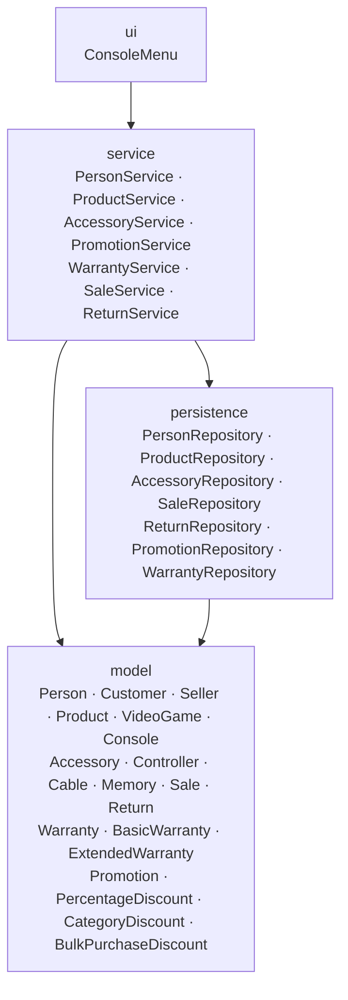

# Layer Dependency Diagram — GameZone Unicesar

The integrated system keeps the four layers of the Taller. Every class of the base system and of the four extensions (accessories, promotions, warranties and returns) belongs to exactly one of them.

## Allowed dependencies

- `ui` depends on `service`: `ConsoleMenu` talks to the seven services and never to a repository.
- `service` depends on `persistence` and on `model`: each service is the only one allowed to call its repository, and it applies the business rules over the model classes.
- `persistence` depends on `model`: the repositories read and write model objects in the JSON files of the `data` folder.
- `model` depends on nothing: the domain classes contain no file access and no reference to the user interface.

## Dependencies introduced by the integration

- A service may use other services of the same layer. `SaleService` uses `PersonService`, `ProductService`, `AccessoryService`, `WarrantyService` and `PromotionService`; `ReturnService` uses `SaleService`, `PersonService`, `ProductService`, `AccessoryService` and `WarrantyService`; `WarrantyService` uses `ProductService`. They are all downward or lateral dependencies inside the `service` layer, and none of them goes back to the `ui`.
- `WarrantyService` also uses `SaleRepository` (`service → persistence`) to resolve the sales of the stored warranties, so `WarrantyRepository` does not depend on any other module (adjustment A2).
- `Main` is outside the layers: it creates the repositories, then the services (`WarrantyService` before `SaleService`) and finally the menu.

## Forbidden dependencies

`ui → persistence` (the menu must go through a service), `model → persistence`, `model → service`, `model → ui`, `persistence → service`, `persistence → ui` and `service → ui`.
