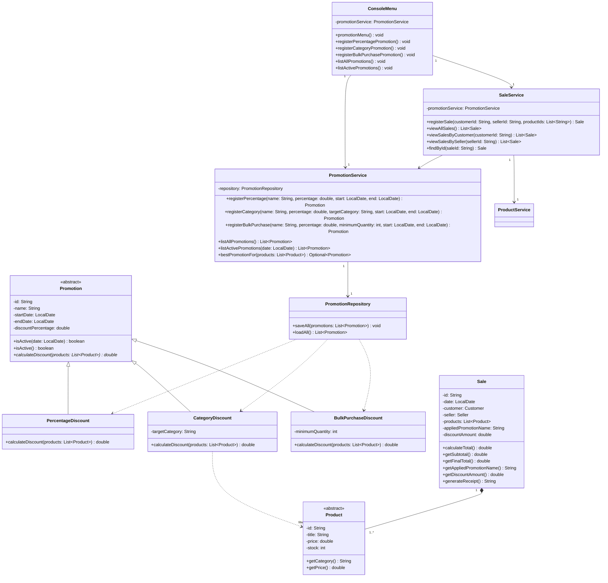

# Promotion Class Diagram — GameZone Unicesar

```mermaid
classDiagram

    %% ===== MODEL: PROMOTION HIERARCHY =====
    class Promotion {
        <<abstract>>
        -id: String
        -name: String
        -startDate: LocalDate
        -endDate: LocalDate
        -discountPercentage: double
        +isActive(date: LocalDate) boolean
        +isActive() boolean
        +calculateDiscount(products: List~Product~) double*
    }
    class PercentageDiscount {
        +calculateDiscount(products: List~Product~) double
    }
    class CategoryDiscount {
        -targetCategory: String
        +calculateDiscount(products: List~Product~) double
    }
    class BulkPurchaseDiscount {
        -minimumQuantity: int
        +calculateDiscount(products: List~Product~) double
    }
    Promotion <|-- PercentageDiscount
    Promotion <|-- CategoryDiscount
    Promotion <|-- BulkPurchaseDiscount

    %% ===== PRODUCT INTEGRATION (CATEGORY PROMOTIONS) =====
    class Product {
        <<abstract>>
        -id: String
        -title: String
        -price: double
        -stock: int
        +getCategory() String
        +getPrice() double
    }
    CategoryDiscount ..> "filters products of one category" Product

    %% ===== SALE INTEGRATION =====
    class Sale {
        -id: String
        -date: LocalDate
        -customer: Customer
        -seller: Seller
        -products: List~Product~
        -appliedPromotionName: String
        -discountAmount: double
        +calculateTotal() double
        +getSubtotal() double
        +getFinalTotal() double
        +getAppliedPromotionName() String
        +getDiscountAmount() double
        +generateReceipt() String
    }
    Sale "1" *-- "1..*" Product

    %% ===== PERSISTENCE LAYER =====
    class PromotionRepository {
        +saveAll(promotions: List~Promotion~) void
        +loadAll() List~Promotion~
    }
    PromotionRepository ..> PercentageDiscount
    PromotionRepository ..> CategoryDiscount
    PromotionRepository ..> BulkPurchaseDiscount

    %% ===== SERVICE LAYER =====
    class PromotionService {
        -repository: PromotionRepository
        +registerPercentage(name: String, percentage: double, start: LocalDate, end: LocalDate) Promotion
        +registerCategory(name: String, percentage: double, targetCategory: String, start: LocalDate, end: LocalDate) Promotion
        +registerBulkPurchase(name: String, percentage: double, minimumQuantity: int, start: LocalDate, end: LocalDate) Promotion
        +listAllPromotions() List~Promotion~
        +listActivePromotions(date: LocalDate) List~Promotion~
        +bestPromotionFor(products: List~Product~) Optional~Promotion~
    }
    class SaleService {
        -promotionService: PromotionService
        +registerSale(customerId: String, sellerId: String, productIds: List~String~) Sale
        +viewAllSales() List~Sale~
        +viewSalesByCustomer(customerId: String) List~Sale~
        +viewSalesBySeller(sellerId: String) List~Sale~
        +findById(saleId: String) Sale
    }

    PromotionService "1" --> "1" PromotionRepository
    SaleService "1" --> "1" PromotionService
    SaleService "1" --> "1" ProductService

    %% ===== UI LAYER =====
    class ConsoleMenu {
        -promotionService: PromotionService
        +promotionMenu() void
        +registerPercentagePromotion() void
        +registerCategoryPromotion() void
        +registerBulkPurchasePromotion() void
        +listAllPromotions() void
        +listActivePromotions() void
    }
    ConsoleMenu "1" --> "1" PromotionService
    ConsoleMenu "1" --> "1" SaleService
```