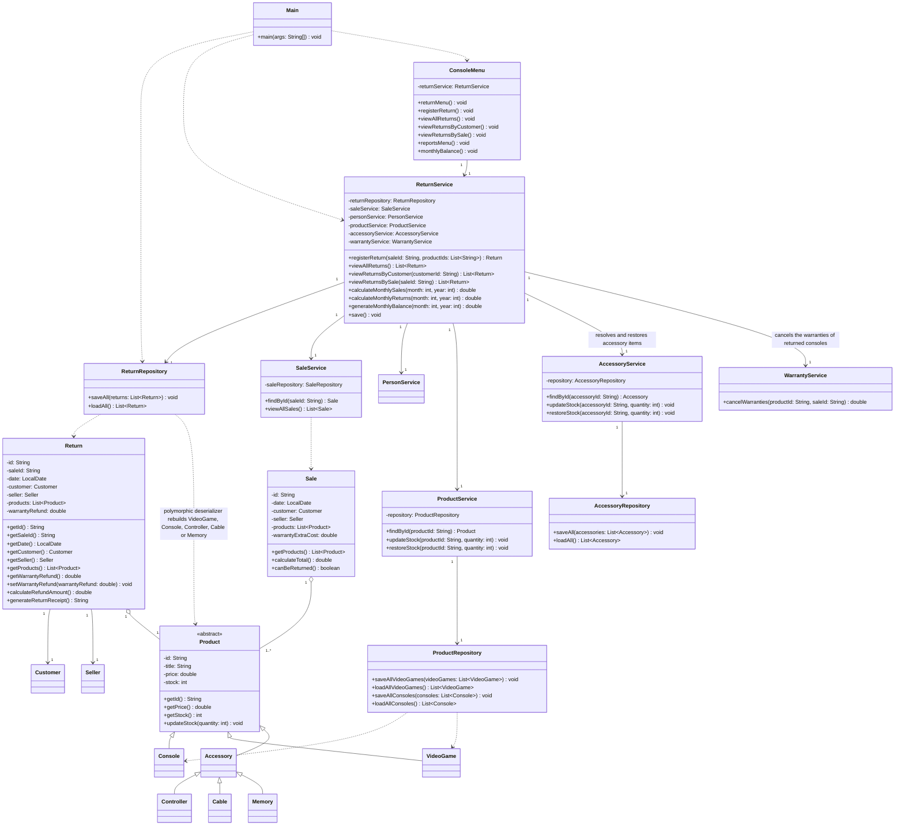

# Return Class Diagram — GameZone Unicesar

Return module and its integration with the sales flow. Classes that already existed are shown
only with the members involved in the integration.

## Integration notes

- `ReturnService.registerReturn` is the only entry point of the module. Its order matters:
  validate the arguments, locate the sale, verify the return period with
  `Sale.canBeReturned()`, verify that every item was part of the sale and was not already
  returned, and only then restore the stock and persist the new return. A rejected return
  therefore leaves the inventory untouched.
- A returned item is resolved through `ReturnService.resolveItem`, which looks in
  `ProductService` first and falls back to `AccessoryService`, so a sale that mixes video games,
  consoles and accessories can be returned in full. The stock is then restored through the service
  that owns the item type: `AccessoryService.restoreStock` for accessories and
  `ProductService.restoreStock` for products. Both methods increment the current stock, unlike
  their `updateStock` counterparts, which replace it with an absolute value.
- A return is stored with the identifiers of the sale and of the items, plus the customer
  and the seller copies needed to print the receipt; `ReturnRepository` rebuilds the
  polymorphic `Product` hierarchy with a Gson deserializer that covers the whole catalog
  (`VideoGame`, `Console`, `Controller`, `Cable` and `Memory`), using the same discriminators
  already applied in `SaleRepository`.
- `Return` keeps a reference to the products it returns, and `ReturnService` obtains them
  from `ProductService`, so the return always reflects the current catalog data instead of
  duplicating the prices.
- The monthly balance is derived from the sales owned by `SaleService` and from the returns
  owned by `ReturnService`, which is why the report lives in `ReturnService`. Since adjustment
  A6 the report is split into three methods: `calculateMonthlySales` adds the final total of
  every sale of the month (`Sale.calculateTotal()`, that is, subtotal minus the promotion
  discount plus the extended warranty cost), `calculateMonthlyReturns` adds the refund of every
  return of the month, and `generateMonthlyBalance` keeps its signature and returns the
  difference between both. The balance may be negative, for example when the returns of a month
  belong to sales of the previous month, so it is reported instead of raising an exception.
  `ConsoleMenu.monthlyBalance` prints the three values.
- A returned console cannot keep an active warranty (adjustment A7). After the stock is restored,
  `ReturnService.registerReturn` calls `WarrantyService.cancelWarranties(productId, saleId)` once
  per returned console unit and stores the sum of the returned values in
  `Return.warrantyRefund`. `Return.calculateRefundAmount()` adds that value to the refund of the
  items, and `Return.generateReturnReceipt()` shows it on its own line.
