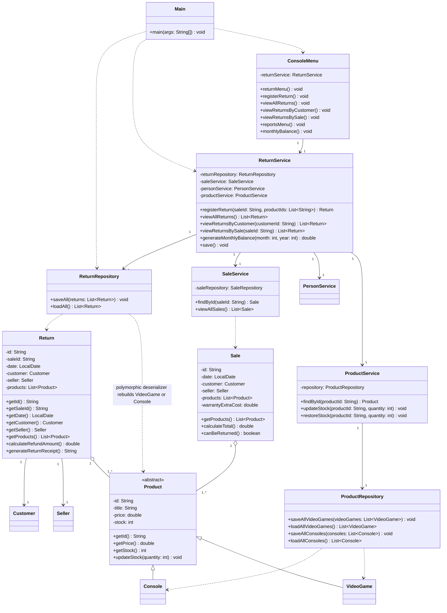

# Return Class Diagram — GameZone Unicesar

Return module and its integration with the sales flow. Classes that already existed are shown
only with the members involved in the integration.

## Integration notes

- `ReturnService.registerReturn` is the only entry point of the module. Its order matters:
  validate the arguments, locate the sale, verify the return period with
  `Sale.canBeReturned()`, verify that every item was part of the sale and was not already
  returned, and only then restore the stock and persist the new return. A rejected return
  therefore leaves the inventory untouched.
- A return is stored with the identifiers of the sale and of the items, plus the customer
  and the seller copies needed to print the receipt; `ReturnRepository` rebuilds the
  polymorphic `Product` hierarchy with a Gson deserializer.
- `Return` keeps a reference to the products it returns, and `ReturnService` obtains them
  from `ProductService`, so the return always reflects the current catalog data instead of
  duplicating the prices.
- The monthly balance is derived from the sales owned by `SaleService` and from the returns
  owned by `ReturnService`, which is why the report lives in `ReturnService`.