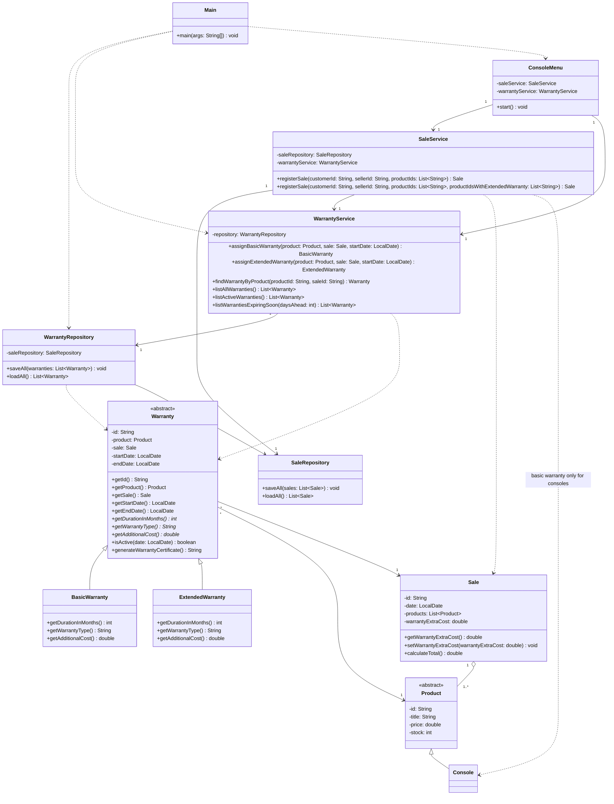

# Warranty Class Diagram — GameZone Unicesar

Warranty module and its integration with the existing sales flow. Classes that already existed are shown only with the members involved in the integration.

## Integration notes

- `SaleService.registerSale` creates one `BasicWarranty` for every `Console` in the sale and one `ExtendedWarranty` for each console whose identifier is listed in `productIdsWithExtendedWarranty`. The cost of the extended warranties is stored in `Sale.warrantyExtraCost` and included in `Sale.calculateTotal()`.
- `WarrantyRepository` persists only the identifiers of the sale and the product (`data/warranties.csv`, with a `BASIC`/`EXTENDED` discriminator) and rebuilds the references through `SaleRepository` when loading.
- The original three-parameter `registerSale` remains and delegates to the new overload, so the existing behavior is not broken.
