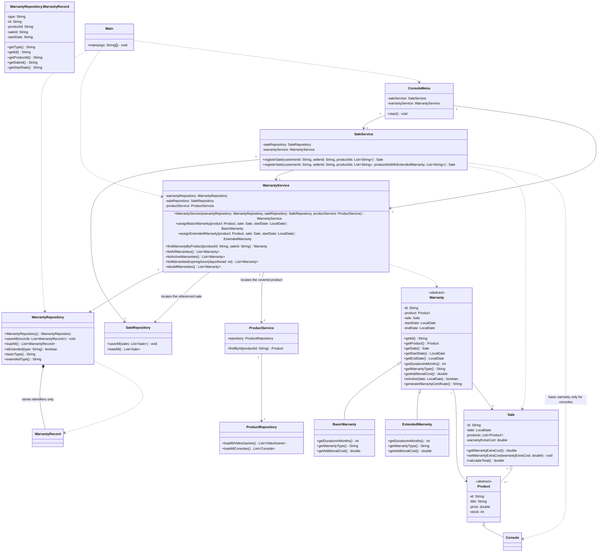

# Warranty Class Diagram — GameZone Unicesar

Warranty module and its integration with the existing sales flow. Classes that already existed are shown only with the members involved in the integration.

```mermaid
classDiagram

    %% ===== MODEL LAYER =====
    class Warranty {
        <<abstract>>
        -id: String
        -product: Product
        -sale: Sale
        -startDate: LocalDate
        -endDate: LocalDate
        +getId() String
        +getProduct() Product
        +getSale() Sale
        +getStartDate() LocalDate
        +getEndDate() LocalDate
        +getDurationInMonths() int*
        +getWarrantyType() String*
        +getAdditionalCost() double*
        +isActive(date: LocalDate) boolean
        +generateWarrantyCertificate() String
    }
    class BasicWarranty {
        +getDurationInMonths() int
        +getWarrantyType() String
        +getAdditionalCost() double
    }
    class ExtendedWarranty {
        +getDurationInMonths() int
        +getWarrantyType() String
        +getAdditionalCost() double
    }
    class Product {
        <<abstract>>
        -id: String
        -title: String
        -price: double
        -stock: int
    }
    class Console
    class Sale {
        -id: String
        -date: LocalDate
        -products: List~Product~
        -warrantyExtraCost: double
        +getWarrantyExtraCost() double
        +setWarrantyExtraCost(warrantyExtraCost: double) void
        +calculateTotal() double
    }

    Warranty <|-- BasicWarranty
    Warranty <|-- ExtendedWarranty
    Product <|-- Console
    Warranty "*" --> "1" Product
    Warranty "*" --> "1" Sale
    Sale "1" o-- "1..*" Product

    %% ===== PERSISTENCE LAYER =====
    class WarrantyRepository {
        +WarrantyRepository() WarrantyRepository
        +saveAll(records: List~WarrantyRecord~) void
        +loadAll() List~WarrantyRecord~
        +isExtended(type: String) boolean
        +basicType() String
        +extendedType() String
    }
    class WarrantyRepository.WarrantyRecord {
        -type: String
        -id: String
        -productId: String
        -saleId: String
        -startDate: String
        +getType() String
        +getId() String
        +getProductId() String
        +getSaleId() String
        +getStartDate() String
    }
    class SaleRepository {
        +saveAll(sales: List~Sale~) void
        +loadAll() List~Sale~
    }
    class ProductRepository {
        +loadAllVideoGames() List~VideoGame~
        +loadAllConsoles() List~Console~
    }

    WarrantyRepository *-- WarrantyRecord : stores identifiers only
    WarrantyRepository ..> WarrantyRecord

    %% ===== SERVICE LAYER =====
    class WarrantyService {
        -warrantyRepository: WarrantyRepository
        -saleRepository: SaleRepository
        -productService: ProductService
        +WarrantyService(warrantyRepository: WarrantyRepository, saleRepository: SaleRepository, productService: ProductService) WarrantyService
        +assignBasicWarranty(product: Product, sale: Sale, startDate: LocalDate) BasicWarranty
        +assignExtendedWarranty(product: Product, sale: Sale, startDate: LocalDate) ExtendedWarranty
        +findWarrantyByProduct(productId: String, saleId: String) Warranty
        +listAllWarranties() List~Warranty~
        +listActiveWarranties() List~Warranty~
        +listWarrantiesExpiringSoon(daysAhead: int) List~Warranty~
        -rebuildWarranties() List~Warranty~
    }
    class SaleService {
        -saleRepository: SaleRepository
        -warrantyService: WarrantyService
        +registerSale(customerId: String, sellerId: String, productIds: List~String~) Sale
        +registerSale(customerId: String, sellerId: String, productIds: List~String~, productIdsWithExtendedWarranty: List~String~) Sale
    }
    class ProductService {
        -repository: ProductRepository
        +findById(productId: String) Product
    }

    WarrantyService "1" --> "1" WarrantyRepository
    WarrantyService "1" --> "1" SaleRepository : locates the referenced sale
    WarrantyService "1" --> "1" ProductService : locates the covered product
    ProductService "1" --> "1" ProductRepository
    SaleService "1" --> "1" SaleRepository
    SaleService "1" --> "1" WarrantyService
    SaleService ..> Sale
    SaleService ..> Console : basic warranty only for consoles
    WarrantyService ..> Warranty

    %% ===== UI LAYER =====
    class ConsoleMenu {
        -saleService: SaleService
        -warrantyService: WarrantyService
        +start() void
    }

    ConsoleMenu "1" --> "1" SaleService
    ConsoleMenu "1" --> "1" WarrantyService

    %% ===== ENTRY POINT =====
    class Main {
        +main(args: String[]) void
    }

    Main ..> WarrantyRepository
    Main ..> WarrantyService
    Main ..> ConsoleMenu
```

## Integration notes

- `SaleService.registerSale` creates one `BasicWarranty` for every `Console` in the sale and one `ExtendedWarranty` for each console whose identifier is listed in `productIdsWithExtendedWarranty`. The cost of the extended warranties is stored in `Sale.warrantyExtraCost` and included in `Sale.calculateTotal()`.
- `WarrantyRepository` persists and loads only identifiers: one `WarrantyRecord` per warranty with the `BASIC`/`EXTENDED` discriminator, the warranty identifier, the product identifier, the sale identifier and the start date, stored in `data/warranties.json`. The end date is never stored because every warranty derives it from its start date and its duration. The repository has **no** dependency on any other component.
- The references are rebuilt by `WarrantyService.rebuildWarranties()`, which locates the sale through `SaleRepository` and the covered product through `ProductService`. A record whose sale or product can no longer be found is skipped with a message on the error stream instead of breaking the whole load.
- Because the resolution lives in the service layer and the repository depends on nothing, no cycle can be formed between the sales and the warranties flows. The whole graph is built with plain constructor injection, in this order inside `Main`: repositories, `PersonService`/`ProductService`/`AccessoryService`, `WarrantyService`, `SaleService`, `ReturnService`, `ConsoleMenu`.
- The original three-parameter `registerSale` remains and delegates to the new overload, so the existing behavior is not broken.
